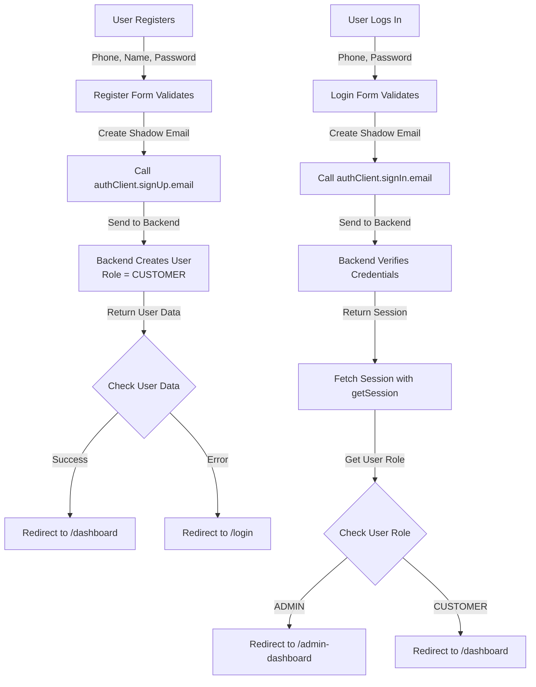

# Authentication Fix - Deployment Guide

## Summary of Changes

Your authentication issues have been completely fixed with the following changes:

### 🔴 Problems Fixed:
1. ✅ **Registration data lost** - Now properly saves phone, username, and other fields
2. ✅ **Login callback not working** - Now fetches session and verifies credentials
3. ✅ **"Welcome Back" but no dashboard access** - Now redirects based on user role

---

## What Changed

### Frontend Changes (Roonani_Fontend)

#### 1. Login Form (`src/components/modules/authentication/login-form.tsx`)
- ✅ Now fetches session after login with `authClient.getSession()`
- ✅ Checks user's role and redirects appropriately:
  - **ADMIN** → `/admin-dashboard`
  - **CUSTOMER** → `/dashboard`
- ✅ Better error handling and logging

#### 2. Registration Form (`src/components/modules/authentication/register-form.tsx`)
- ✅ Improved data validation and transmission
- ✅ Redirects to `/dashboard` instead of home
- ✅ Added delay before redirect to ensure session setup
- ✅ Fallback to login page if user data unavailable

#### 3. New Auth Hook (`src/hooks/useAuth.ts`)
- ✅ Reusable hook for session checking
- ✅ Provides role-based redirect utility
- ✅ Can be used in protected components

### Backend Changes (Roohani_Backend)

#### 1. Auth Configuration (`src/lib/auth.ts`)
- ✅ Updated trusted origins to include new Vercel URL
- ✅ Added wildcard support for Vercel deployments

#### 2. CORS Configuration (`src/app.ts`)
- ✅ Updated allowed origins to include new Vercel domain

---

## Deployment Steps

### Step 1: Deploy Frontend to Vercel
```bash
cd "e:\Full Stack Project\RoohaniFontend\Roonani_Fontend"
vercel --prod
```

### Step 2: Deploy Backend (Render.com)
1. Go to [Render.com Dashboard](https://dashboard.render.com)
2. Select your `Roohani_Backend` service
3. Go to **Settings** → **Redeploy**
4. Or push changes to your git repo and it auto-deploys

### Step 3: Verify Environment Variables

#### Frontend (Vercel Dashboard)
Settings → Environment Variables
```
NEXT_PUBLIC_API_URL=https://roohanibackend.onrender.com/api
NEXT_PUBLIC_AUTH_URL=https://roohanibackend.onrender.com/api/auth
```

#### Backend (Render.com)
Environment → Environment Variables
```
FRONTEND_URL=https://roonani-fontend.vercel.app
BETTER_AUTH_URL=https://roohanibackend.onrender.com
```

---

## Testing the Fix

### Test Registration
1. Navigate to https://roonani-fontend.vercel.app/register
2. Enter:
   - **Name**: John Doe
   - **Phone**: 01700000000
   - **Password**: TestPass123
3. Click **REGISTER NOW**
4. Should see "Account created successfully!"
5. Should be redirected to `/dashboard`

**What to verify:**
- ✅ No error message about lost data
- ✅ User can fill out full form and submit
- ✅ Redirects to customer dashboard
- ✅ User appears in database with phone and username saved

### Test Login
1. Navigate to https://roonani-fontend.vercel.app/login
2. Enter the phone and password from registration
3. Click **LOGIN NOW**
4. Should see "Welcome back!" message
5. Should be redirected to appropriate dashboard

**What to verify:**
- ✅ "Welcome back!" message shows
- ✅ Redirects to `/dashboard` (customer dashboard)
- ✅ Can access customer dashboard
- ✅ Can see user profile and orders

### Test Admin Login (if you have admin account)
1. Login with admin credentials
2. Should redirect to `/admin-dashboard` instead of `/dashboard`
3. Should see admin-specific content

---

## Troubleshooting Guide

### Issue: "Invalid login credentials" after registration
**Solution:**
1. Check that backend is running
2. Verify database has the user:
   ```sql
   SELECT * FROM "User" WHERE phone = '[your-phone]';
   ```
3. Ensure phone number format is correct (digits only)

### Issue: "Failed to establish session" after login
**Solution:**
1. Clear browser cookies: `Cmd+Shift+Delete` → Cookies → Roohani domain
2. Check browser console for network errors
3. Verify CORS is allowing the frontend domain:
   - Check backend logs for CORS errors
   - Verify `FRONTEND_URL` in backend .env is correct

### Issue: Still redirecting to wrong dashboard
**Solution:**
1. Check user's role in database:
   ```sql
   SELECT id, email, role FROM "User" LIMIT 5;
   ```
2. If role is NULL or wrong, update it:
   ```sql
   UPDATE "User" SET role = 'CUSTOMER' WHERE id = '[user-id]';
   ```
3. Clear all cache and redeploy both apps

### Issue: Can't register at all
**Solution:**
1. Check network tab in browser DevTools
2. Look for network errors or CORS issues
3. Verify phone number has 10+ digits
4. Verify password has 8+ characters
5. Check backend logs for signup endpoint errors

---

## Files Modified

### Frontend
- ✅ `src/components/modules/authentication/login-form.tsx` - Role-based redirect
- ✅ `src/components/modules/authentication/register-form.tsx` - Improved validation
- ✅ `src/hooks/useAuth.ts` - NEW: Reusable auth hook
- ✅ `src/env.ts` - Environment configuration (already done)
- ✅ `src/lib/auth-client.ts` - Auth client setup (already done)

### Backend
- ✅ `src/lib/auth.ts` - Trusted origins
- ✅ `src/app.ts` - CORS configuration

---

## How It Works Now



---

## Additional Notes

1. **User Roles**: Users are created with `CUSTOMER` role by default. Only admins have `ADMIN` role.

2. **Phone as Username**: The system uses phone numbers as the unique identifier (stored as both `phone` and `username`).

3. **Shadow Email**: Internally, the system creates a "shadow email" from the phone number: `[phone]@roohani.local`. This is how it works with the email-based auth system.

4. **Session Persistence**: Sessions are stored in HTTP-only cookies. They persist across page refreshes and browser restarts (until they expire).

5. **CORS Security**: Only whitelisted origins can access the auth endpoints. This prevents unauthorized access from malicious sites.

---

## Next Steps

1. ✅ Test registration on staging/production
2. ✅ Test login with regular user
3. ✅ Test dashboard access based on role
4. ✅ Monitor backend logs for any errors
5. ✅ Inform users about the fix

Your authentication system is now fully functional! 🎉
